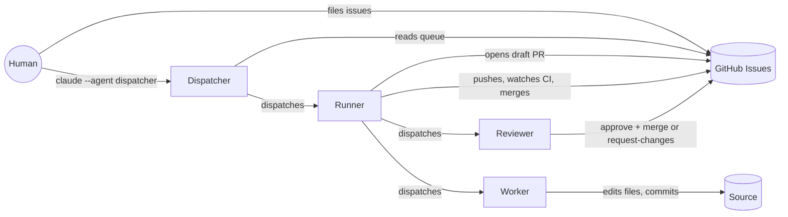
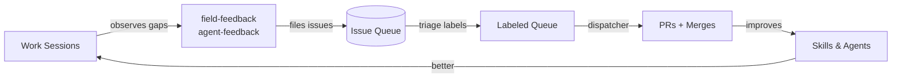

# agent-tools

[](https://github.com/joshrotenberg/agent-tools/actions/workflows/ci.yml)
[](https://github.com/joshrotenberg/agent-tools/releases)
[](LICENSE-MIT)

My custom skills and subagents for working with Claude Code.

## Entry point

After install, the primary invocation is:

```
claude --agent dispatcher
```

Dispatcher reads your GitHub issue queue, decides execution shape, and fires
runners. Runners dispatch workers that branch, edit files, open PRs, watch CI,
and merge. The entire pipeline runs automatically.

Typical session:

1. File issues (describe what you want done)
2. Run: `claude --agent dispatcher`
3. Review merged PRs

## Architecture



## What's in here

- **`skills/`** -- operational knowledge. Process discipline, git
  workflow, dispatch patterns, sandbox preflight, release-audit
  anchoring, and the rest of the patterns I've found load-bearing
  across projects.
- **`agents/`** -- subagent definitions. `runner` does one task
  end-to-end; `dispatcher` gathers context, decides execution
  shape, and fires runners (single, parallel, sequential, etc.).

## Agents

| Agent | What it does | Invoke with |
|---|---|---|
| `dispatcher` | Scopes units of work, decides execution shape, fires runners | `@dispatcher work the backlog` (in-session) or `claude --agent dispatcher` (CLI) |
| `runner` | Implements one GitHub issue end-to-end (branch, draft PR, CI, merge) | `@runner implement #N` |
| `reviewer` | Reviews a PR: approve+merge, request-changes+draft, or approve+note ordering | `@reviewer review #N` |
| `worker` | Bounded code-change executor; reads context, edits files, commits | (dispatched by runner) |
| `auditor` | Read-only audit of a codebase against a rubric; files findings as issues | `@auditor audit <domain>`, or dispatched for audit+remediate |

See `agents/README.md` for invocation details and when to skip the dispatcher and
go straight to the runner.

## Feedback loop



The `field-feedback` and `agent-feedback` skills file GitHub issues automatically
when agents encounter problems during dispatch. `@dispatcher triage open issues`
labels and prioritizes them. Runners work the queue. The loop closes.

## How it fits together

- Skills provide operational knowledge loaded at dispatch time
- Agents define roles (dispatcher, runner, worker, reviewer)
- Durable state (GitHub issues, PRs, CLAUDE.md, code) is the substrate -- agents are ephemeral, state persists
- The self-improving loop: use -> observe -> file -> fix -> repeat

## Getting started on a new project

1. `touch CLAUDE.md` -- marks the project for workspace survey.
2. Write Overview, Architecture, and Current Status sections.
3. `@dispatcher work the backlog` or `@runner implement #N`.

## Install

agent-tools ships as a Claude Code plugin, and the repo is its own
marketplace. This works in both the CLI and the desktop app:

```
claude plugin marketplace add joshrotenberg/agent-tools
claude plugin install agent-tools@agent-tools
```

Plugin components are namespaced under `agent-tools:` -- the dispatcher is
`agent-tools:dispatcher`, skills invoke as `/agent-tools:<skill>`. Pull
updates later with `claude plugin marketplace update`.

For local development (edit + reload, nothing installed):

```
claude --plugin-dir /path/to/agent-tools   # reload after edits
```

### Alternative: copy into ~/.claude

`install.sh` copies `skills/*` into `~/.claude/skills/` and `agents/*` into
`~/.claude/agents/`, where Claude Code auto-discovers them. Components are
unnamespaced this way, so `claude --agent dispatcher` works directly.

```bash
./install.sh
```

Options:

- `--to PATH` -- install under PATH/skills and PATH/agents
  instead of `~/.claude/`
- `--force` -- overwrite existing entries without prompting
- `--skip` -- skip existing entries without prompting (default
  on non-TTY)
- `--dry-run` -- print what would be copied; touch nothing

## Install from a release

To install without cloning the repo:

```bash
# Latest release
gh release download --repo joshrotenberg/agent-tools \
  --pattern "*.tar.gz" --dir /tmp/agent-tools
cd /tmp/agent-tools && tar xzf *.tar.gz && ./install.sh

# Specific version
gh release download v0.2.0 --repo joshrotenberg/agent-tools \
  --pattern "*.tar.gz" --dir /tmp/agent-tools
cd /tmp/agent-tools && tar xzf *.tar.gz && ./install.sh
```

Releases are created automatically when `feat:`, `fix:`, or `docs:` commits
land on main. See [releases](https://github.com/joshrotenberg/agent-tools/releases)
for available versions.

## License

Licensed under [MIT](LICENSE-MIT) or [Apache 2.0](LICENSE-APACHE), at your option.
